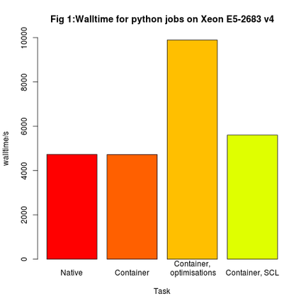
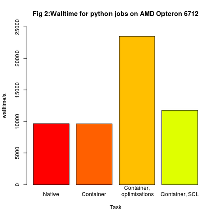
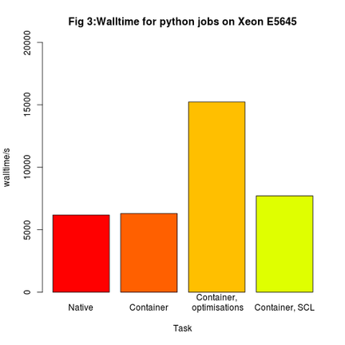

# Benchmarking python with singularity containers

[Singularity](http://singularity.lbl.gov/) is a container solution designed for HPC.
Due to the secure and simple design, it can be easily used to provide
applications for use with HPC clusters where other containers, such as Docker
would not be suitable.

## Testing python inside containers

Linux containers offer a great way to compare software performance on a production system without installing extra packages on your shared filesystem.

After early tests on 3 different node type using python 2.7.8 on CentOS6 containers showed SCL python running the same code between 16-25% more slowly than a self-compiled python 2.7.8 running natively, further tests were performed, instead with CentOS 7.

A single-core python job to find [primes of a large number](https://github.com/sbutcher/python_test/blob/master/python_prime2.py) was run natively on a compute node via the Univa Grid Engine job scheduler. The job was then repeated on the same node inside a container running the same version of python compiled with gcc, and also a packaged python provided by the CentOS [Software Collections Library](https://wiki.centos.org/AdditionalResources/Repositories/SCL). The SCL is marketed as a simple way to get multiple versions of python on your enterprise OS without having to compile new versions. Jobs were run in 4 different environments:

* native CentOS 7.3 (no container), running python 2.7.13 compiled on CentOS 7.3 (A)
* Singularity container, running CentOS 7.3 and python 2.7.13 compiled from source (B)
* Singularity container, running CentOS 7.3 and python 2.7.13 compiled from source, configured with --enable-optimizations flag (C)
* Singularity container, running CentOS 7.3 and python 2.7.13 package via CentOS SCL (D)

Where python was compiled (tasks A,B,C), the distribution-provided gcc version 4.8.5 was used. Task B is closest to the enviroment provided used by the control task A and can be directly compared to see if using a container has any affect on performance versus the native OS.

### Wallclock Results

The following statistics were gathered from the Grid Engine `qacct` command, and rounded to the nearest whole number for readability. Walltimes were compared with the output of  passing the `time` command to the python command, to give confidence in the results.

#### Processor type: Xeon E5-2683 v4

| Task | Wallclock/s | ioops  | mem/MB   |
| --- | ----:   | ---: | ----: |
| A  | 4731   | 3751   | 566  |
| B  | 4723   | 3943   | 565  |
| C  | 9892   | 3937   | 1184 |
| D  | 5604   | 3976   | 681  |

#### Processor type: AMD Opteron 6712

| Task | Wallclock/s | ioops | mem/MB   |
| ---| -----:  | ---: | ----: |
| A  | 9687    | 3975  | 1160 |
| B  | 9667    | 4166  | 1158 |
| C  | 23478   | 4155  | 2810 |
| D  | 11813   | 4229  | 1436 |

#### Processor type: Xeon E5645

| Task | Wallclock/s | ioops  | mem/MB   |
| -----| -----: | ----: | ----: |
| A  | 6186   | 3373  | 741  |
| B  | 6305   | 3569  | 754  |
| C  | 15237  | 3573  | 1824 |
| D  | 7722   | 3634  | 938  |

## Summary

Comparing the results for task A and B, we see that with like-for-like python installations, using a container does not signicantly affect performance. In fact, the python container was sometimes a few seconds faster. This value is the total wallclock time reported by the job scheduler, and includes the time taken to load the container file.

The SCL python runs consistently slower than the compiled python on all nodes types, suggesting that, although convenient, may not be suitable for HPC environments.

The python compiled with `--enable-optimizations` performed very poorly, and should be a lesson to system administrators not to blindly follow suggestions without testing. Quite why it performed so badly requires further investigation.

Containers provide an excellent way to provision tricky applications, particularly in the Bioinformatics and Deep-learning disciplines, but additionally provide a safe and easy way to gain performance improvements and new features offered by the latest and greatest versions of common applications, while offering an easy way to compare different configuration and compilation options that, as we have seen, could have significant impact on performance, which is critical in an HPC environment.

## Data files

The Singularity definition files used for these tests can be found on [Github](https://github.com/sbutcher/python_test).
